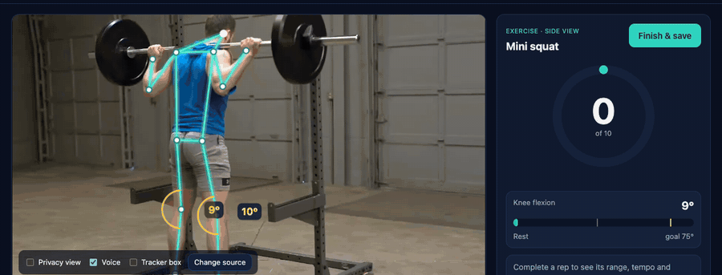
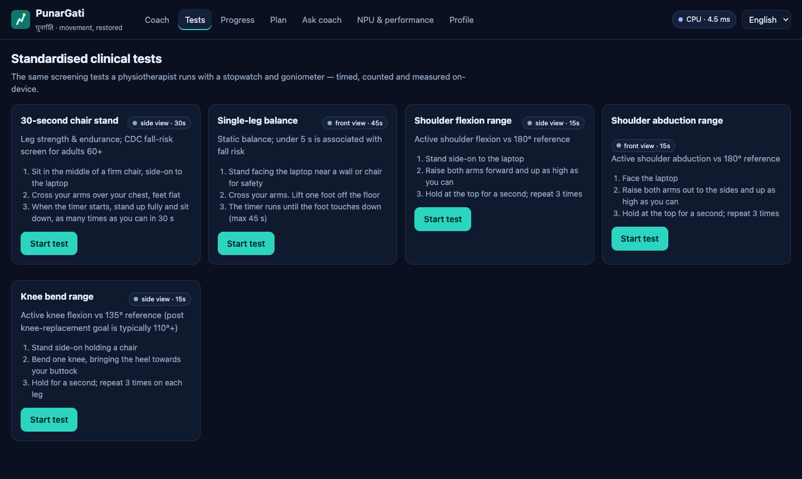
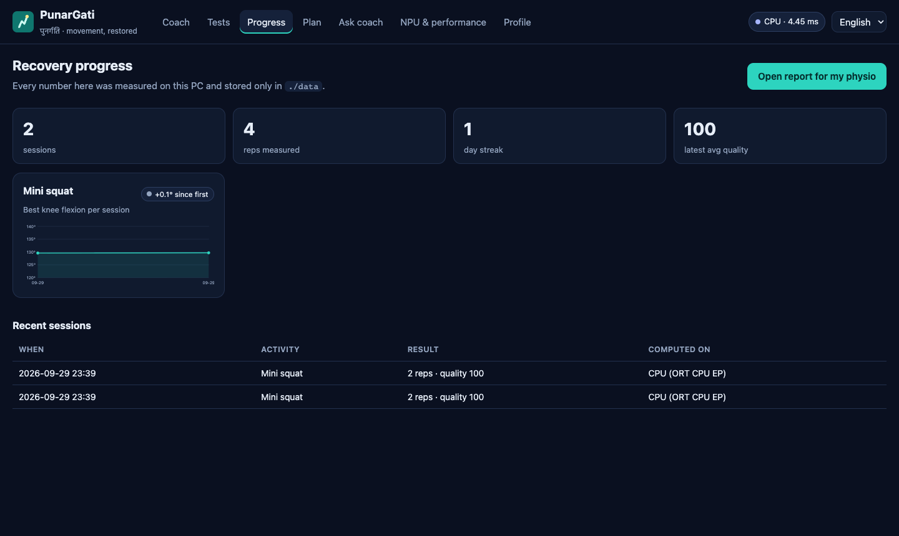
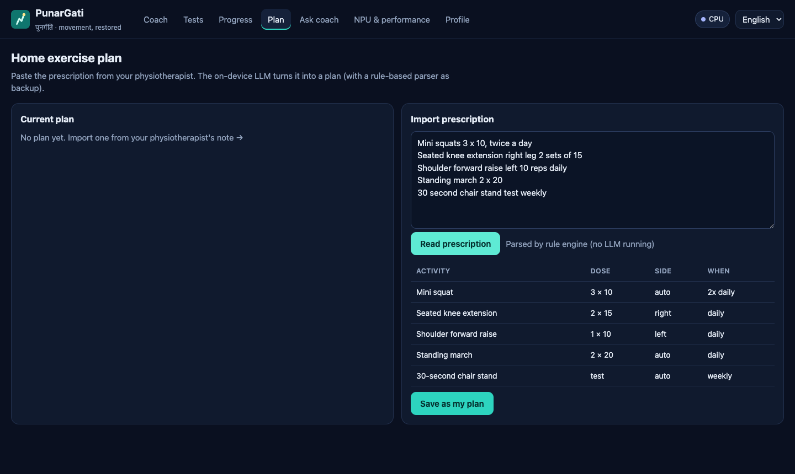
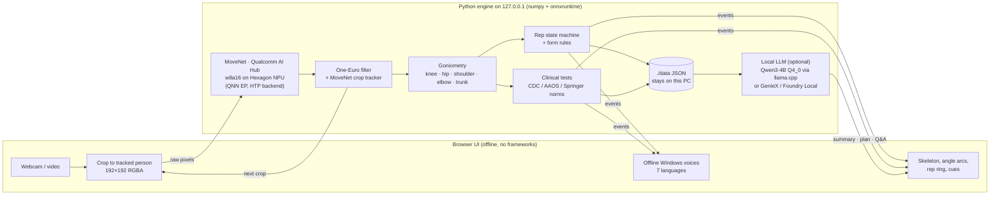

# PunarGati · पुनर्गति

**Your physiotherapist's eyes at home.** PunarGati is an on-device AI physiotherapy coach for Snapdragon-powered HP PCs (OmniBook X, OmniBook Ultra, EliteBook Ultra and other Copilot+ PCs). It watches you exercise through the laptop camera, counts reps, measures joint angles like a goniometer, corrects your form out loud in 7 Indian languages, runs standard clinical screening tests, and writes a progress report you can hand to your physiotherapist.

Pose tracking runs on the **Snapdragon Hexagon NPU** through ONNX Runtime's QNN execution provider, using a model from **Qualcomm AI Hub**. Session summaries, prescription import and Q&A come from a **local LLM**. No video, health data or prompt ever leaves the PC. It needs no internet connection, no account and no subscription.

> *Punar* (again) + *gati* (movement): "movement, restored".



---

## Why this matters

Recovery from a knee replacement, a frozen shoulder, a fracture or a fall mostly happens **at home**. Patients get a sheet of exercises and see a physiotherapist once a week, if they can travel to one at all. At home nobody counts the reps, checks the form or measures whether the knee bends further than last week. Home programmes are widely reported to be under-done or done wrong, and the physiotherapist only hears about it at the next visit.

India makes this harder:

- **Knee osteoarthritis** is very common in older Indians. A meta-analysis puts prevalence at about 28.7%, and knee replacements are growing quickly.
- **Frozen shoulder** is 2–4× more common in people with diabetes, and India has more than 100 million of them.
- **Falls**: about 1 in 3 adults over 65 falls each year. The 30-second chair-stand and single-leg-stance tests screen for that risk, but they need a trained person with a stopwatch.
- Physiotherapists are concentrated in cities, and most patients in tier-2/3 towns can't get daily supervision.

Sources are in [docs/CLINICAL_BASIS.md](docs/CLINICAL_BASIS.md).

## Why on-device, and why a Snapdragon PC

| Requirement | Why the cloud fails it | How PunarGati meets it on Snapdragon |
|---|---|---|
| **A camera in the bedroom** | Streaming home video of patients to a server is a privacy and DPDP-Act problem | Frames are processed in RAM on the NPU and then dropped. Nothing is stored or sent. There's also a *Privacy view* that shows only the skeleton |
| **Works in tier-2/3 towns** | Needs reliable bandwidth at 30 fps | Fully offline. Models ship inside the repo |
| **Zero marginal cost** | Per-minute inference bills make ₹0 home rehab impossible | One-time laptop, unlimited sessions |
| **Real-time feedback** | A round trip adds lag and ruins rep timing | ~1 ms pose inference on the Hexagon NPU ([AI Hub profile](docs/BENCHMARKS.md)) |
| **Runs for a whole session on battery** | — | The NPU does the continuous vision work, which leaves the CPU free and the fans quiet. Measure it yourself with the built-in NPU / GPU / CPU benchmark |

## What it does

- **Live coaching for 9 exercises**: mini squat, sit-to-stand, seated knee extension, shoulder forward raise, shoulder side raise, elbow curl, standing hip abduction, standing march and heel raise. Reps are counted per side, with range of motion, tempo and a quality score for every rep.
- **Form correction** while you move, spoken and shown on screen: "keep your chest up", "push your knees outward", "keep your elbow straight", "don't shrug"… It also tells you when to turn side-on or step back into frame.
- **Clinical screening tests**, timed and scored on-device:
  - 30-second chair stand (CDC STEADI fall-risk thresholds by age and sex)
  - single-leg stance (age norms; under 5 s flags fall risk)
  - shoulder flexion, shoulder abduction and knee flexion range of motion against AAOS reference values
- **Recovery curves**: best range of motion per session, test scores over time and day streaks. A **printable report** goes to the physiotherapist.
- **Prescription import**: paste the physio's note ("mini squats 3×10 twice a day, R knee LAQ 2 sets of 15…"). A rule engine and the local LLM turn it into a plan with one-tap *Start* buttons.
- **Ask your coach**: a local LLM answers questions using your measured data. Red-flag symptoms like swelling, sharp pain or dizziness always trigger a stop-and-see-your-physio message.
- **7 coaching languages**: English, हिन्दी, தமிழ், తెలుగు, ಕನ್ನಡ, मराठी and বাংলা. Voice cues use Windows' offline speech voices.
- **An "NPU & performance" page** that shows which compute unit runs the model and whether 100% of the graph is on the NPU. It also runs a benchmark comparing NPU, GPU and CPU on latency, CPU load and battery draw.

| Clinical tests | Recovery progress | Prescription → plan |
|---|---|---|
|  |  |  |

<sub>Screenshots were taken on a development machine running the CPU fallback. On a Snapdragon PC the compute badge reads *Hexagon NPU*.</sub>

## Architecture



The browser handles camera, drawing and speech, and Python does all the AI. So the only native dependencies are `numpy`, `onnxruntime` and `onnxruntime-qnn`, and all three ship Windows-on-ARM64 wheels. There's no OpenCV, no PyTorch and no npm build. Details are in [docs/ARCHITECTURE.md](docs/ARCHITECTURE.md).

### AI models

| Model | Source | Runs on | Role |
|---|---|---|---|
| **MoveNet** (w8a16 quantized) | [Qualcomm AI Hub](https://aihub.qualcomm.com/models/movenet) v0.63.0, Apache-2.0 | **Hexagon NPU** (QNN EP · HTP). AI Hub reports 100% of layers on the NPU for Snapdragon X Elite | Always-on 17-keypoint pose |
| **MoveNet** (float) | Qualcomm AI Hub v0.63.0 | Adreno GPU (QNN GPU backend) or CPU | Comparison and fallback |
| **RTMPose-Body2d** (w8a16) | [Qualcomm AI Hub](https://aihub.qualcomm.com/models/rtmpose_body2d) v0.63.0, Apache-2.0 | **Hexagon NPU**, cascaded after MoveNet. AI Hub profiles 1.8 ms with all layers on the NPU | *Precision mode*: 133 COCO-WholeBody keypoints, more accurate body joints, and **feet** for the heel-raise / ankle exercise |
| **Qwen3-4B-Instruct-2507** Q4_0 *(optional)* | GGUF listed in [AI Hub's Qwen3-4B release assets](https://huggingface.co/qualcomm/Qwen3-4B-Instruct-2507) | Oryon CPU via llama.cpp (win-arm64). Any OpenAI-compatible local server works: GenieX/QAIRT on NPU, Foundry Local, LM Studio | Summaries, prescription → plan, Q&A |

Model downloads are pinned to an AI Hub release and **SHA-256 verified** ([punargati/models.py](punargati/models.py)).

## Quick start

### Snapdragon Windows PC (NPU)

```powershell
git clone https://github.com/Sachin0496/punargati.git
cd punargati
powershell -ExecutionPolicy Bypass -File scripts\setup.ps1   # native ARM64 Python + onnxruntime-qnn, then proves the NPU works
scripts\run.ps1                                              # or double-click PunarGati.bat
```

`setup.ps1` finds or installs a **native ARM64** Python. An x64 Python runs under emulation and can't load the NPU plugin. It then installs three packages and runs `python -m punargati.doctor`, which loads MoveNet on the NPU in strict mode and prints its latency. The browser opens at `http://127.0.0.1:8765`.

Optional local LLM coach (≈2.4 GB, one time):

```powershell
scripts\setup-llm.ps1    # llama.cpp win-arm64 + Qwen3-4B-Instruct-2507 Q4_0
scripts\serve-llm.ps1    # PunarGati auto-detects it on 127.0.0.1:8080
```

### Any other laptop (CPU fallback, for judges and reviewers)

```bash
git clone https://github.com/Sachin0496/punargati.git && cd punargati
scripts/setup.sh && scripts/run.sh      # macOS / Linux; on x64 Windows: pip install -r requirements.txt; python -m punargati
```

No webcam? Click **Try the demo clip** on the start screen. It runs the same pipeline on a bundled squat video.

## Engineering notes

- **The NPU is provable, not just claimed.** The NPU session is first created with `session.disable_cpu_ep_fallback=1`. If that succeeds, every operator is on the Hexagon NPU, and the UI shows it. The compiled QNN context is cached (`ep.context_enable`) so later launches skip compilation. A stale cache is detected and rebuilt, and fallback goes NPU → GPU → CPU with the reason shown on screen.
- **Two-model NPU cascade.** In *Precision mode*, MoveNet tracks the person and supplies a box. RTMPose-WholeBody then re-estimates 133 keypoints from a 192×256 patch, decoded with SimCC argmax. Its body joints replace MoveNet's wherever they are confident, and its feet enable ankle measurement. Both models run on the NPU, and the quantized RTMPose matches the float model to 0.7 px.
- **Quantized I/O done right.** The w8a16 AI Hub build takes and returns `uint16` tensors. Scales and zero-points are read from AI Hub's `metadata.json`, so inputs and outputs are quantized and dequantized exactly.
- **Accuracy from a 192 px model.** MoveNet's crop tracker keeps the person filling the model's view. Keypoints are One-Euro filtered in body-scale units, so smoothing doesn't depend on camera distance. Angles are computed in isotropic pixel space.
- **Rep counting that doesn't lie.** Each side runs its own hysteresis state machine (rest → moving → rest) with minimum-duration and timeout guards. Form rules must hold for several consecutive frames before they fire. ROM tests take a median-of-5 so a single-frame glitch can't set a "record".
- **Local-only by construction.** The server binds to `127.0.0.1` and rejects foreign `Host` headers, which guards against DNS rebinding. The LLM client only probes loopback ports, and a remote URL needs an explicit opt-in.
- **Validated on real footage.** On the **CDC's own 30-second chair stand demonstration video** (public domain), PunarGati counts **3/3 stands** (hand count), filmed from the front, where knee angles are useless because the thighs point at the camera. The sit/stand signal is a self-calibrating shoulder-height measure that works in any view. The squat demo clip gives **2/2 reps**. Both clips are regression tests.
- **Tested.** 27 tests cover synthetic-skeleton kinematics, rep counting, clinical-test timelines, the prescription parser, HTTP integration with the real model, and the two real-video regressions: `python -m unittest discover -s tests`. `python -m punargati.offline clip.mp4 --exercise squat` replays any recording through the exact live pipeline.

## Privacy and safety

- Frames exist only in memory for the few milliseconds of inference. Only derived numbers are saved (angles, reps, test scores), in `./data` on your PC.
- PunarGati is a **coaching and screening aid, not a medical device**. It doesn't diagnose or change a prescription, and it tells users to stop and contact a clinician when they report red-flag symptoms. 2-D camera angles can differ from a clinical goniometer, most of all when the joint isn't square to the camera, so it reports trends, not single readings. See [docs/CLINICAL_BASIS.md](docs/CLINICAL_BASIS.md).

## Repository map

```
punargati/            Python engine
  runtime.py          ORT sessions on NPU (QNN HTP) / GPU (QNN GPU) / CPU, strict offload, context cache
  pose.py             MoveNet I/O (uint16 quant), crop tracker
  kinematics.py       One-Euro filter, joint angles, view detection
  exercises.py        exercise library, rep state machine, form rules, quality score
  assessments.py      chair stand, single-leg stance, ROM tests + norms
  engine.py           per-frame pipeline, cue throttling, framing guards
  llm.py / plan.py    local LLM client, summaries, red-flag safety, prescription parser
  report.py           progress aggregation + printable physio report
  bench.py            NPU vs GPU vs CPU benchmark (latency, CPU load, battery W)
  doctor.py           environment and NPU self-check
  server.py           loopback HTTP server + JSON API
web/                  UI (vanilla JS modules, SVG charts, offline voices)
models/               Qualcomm AI Hub MoveNet builds (w8a16 + float)
scripts/              setup / run / LLM scripts for Windows on ARM64 (+ .sh for others)
tests/                unit + integration tests
docs/                 architecture, clinical basis, benchmarks, setup, demo script
```

## Roadmap

- **RTMPose-Body2d wholebody (133 keypoints, AI Hub)** cascaded after MoveNet for ankle, wrist and finger ROM (hand therapy after a stroke)
- **Whisper on the NPU** (AI Hub precompiled QNN) for hands-free "next / stop / pain" voice commands
- **Arduino UNO Q companion**: a rep counter and haptic cue on the UNO Q's LED matrix, building on the Snapdragon AI Lab's PC + UNO Q kit
- **Clinician view**: share a signed report and export ABDM/FHIR observations for the physio's EMR

## Credits

- MoveNet via Qualcomm AI Hub (Apache-2.0). Qwen3 by Alibaba Qwen (Apache-2.0). llama.cpp (MIT). ONNX Runtime and onnxruntime-qnn (MIT).
- Demo clip: "Squat – exercise demonstration video", FitnessScape, CC BY 3.0, via Wikimedia Commons.
- The Windows-on-ARM64 lessons (native ARM64 Python, `Q4_0` + `-t 8` for llama.cpp) come from our earlier Snapdragon X Elite project [Team-Highest/Gaja-alert](https://github.com/Team-Highest/Gaja-alert).

MIT licensed. See [LICENSE](LICENSE).
